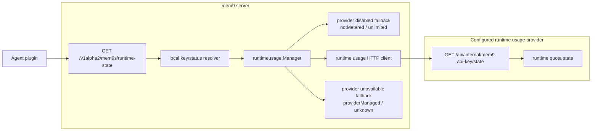

## Summary

Add `GET /v1alpha2/mem9s/runtime-state` to mem9-server for agent plugins.
The endpoint returns plugin-visible runtime quota facts using the same core
shape as the configured runtime usage provider state endpoint:
`mem9ApiKey`, `meters`, `budgets`, optional `quotaGateResult`, optional
`recommendedAction`, optional `providerId`, and optional `providerData`.

Runtime usage enforcement stays on the reservation plane. Runtime-state is a
read plane for warning tiers, constrained-mode notices, and provider actions.
The route uses local API-key status resolution only; tenant data DB resolution
belongs to data-plane memory/import/webhook/session routes.

## Flow



## Runtime-Enabled Behavior

When `MNEMO_RUNTIME_USAGE_ENABLED=true`, mem9-server calls:

```text
GET /api/internal/mem9-api-key/state
Authorization: Bearer <MNEMO_RUNTIME_USAGE_INTERNAL_SECRET>
X-API-Key: <public mem9 API key subject>
```

The response is mapped into the public runtime-state core. mem9-server keeps
`mem9ApiKey.status` from local key/status resolution, fills missing provider
defaults only where required for a stable public shape, returns the configured
`providerId`, and preserves upstream object-shaped `providerData`.

`MNEMO_RUNTIME_USAGE_PROVIDER_ID` controls the public provider discriminator.
When the env var is omitted, mem9-server uses an empty provider id. Upstream
`providerData` and `recommendedAction` remain part of the explicit runtime-state
response contract. Mem9 official hosted deployments set `mem9-official`;
self-hosted deployments usually leave this empty or use their own provider id.
Plugins and API consumers should interpret provider-specific `providerData`
fields only for provider ids they recognize, such as `mem9-official`.

## Success Response Notices

mem9-server also attaches advisory runtime-state notices to successful memory
route responses for plugins that only read recall or ingest responses. This is
an additive response extension for existing response bodies.

### Trigger

The notice path runs only when all conditions below are true:

- Runtime usage is enabled.
- The runtime usage provider id resolves to `mem9-official`.
- The primary recall operation has succeeded, or the memory write request has
  been accepted or completed.
- The runtime state contains a displayable warning or action.

Runtime-state lookup happens after the primary operation succeeds. Lookup
failure omits the advisory fields and writes a warning log, while the successful
recall or write response continues with its normal status code.

### Response Shape

Successful recall responses may include the optional top-level fields below:

```text
{
  "memories": [...],
  "total": 1,
  "limit": 10,
  "offset": 0,
  "message": "mem9 recall has used 80% of included quota. Upgrade your plan to get more included usage.",
  "runtimeState": RuntimeStateResponse
}
```

Successful ingest responses may include the same optional fields on top-level
status responses:

```text
{
  "status": "accepted",
  "message": "Mem9 needs account or billing attention. Open https://console.example.com/console/billing/plan to upgrade your plan.",
  "runtimeState": RuntimeStateResponse
}
```

Successful `201 Created` memory-object responses may include the same optional
top-level `message` and `runtimeState` fields.

`runtimeState` uses the same public response shape as
`GET /v1alpha2/mem9s/runtime-state`. mem9-server returns it as-is after the
provider-id guard.

### Message Selection

The `message` field is fixed English user-facing copy. The server returns at
most one notice per response, using this template:

```text
<feature> <state>. <action>.
```

Priority order:

1. Inactive API key.
2. Blocking recommended action or gate result.
3. Rate-limited gate result.
4. Constrained usage mode, such as on-demand or post-quota usage.
5. Exhausted or urgent budget.
6. Warning budget.

Example messages:

- `This API key is inactive. Run mem9 setup again or create a new API key to keep memory access available.`
- `Mem9 needs account or billing attention. Open https://console.example.com/console/billing/plan to upgrade your plan.`
- `mem9 recall has used 80% of included quota. Upgrade your plan to get more included usage.`
- `mem9 memory saving is using on-demand usage. Review billing settings in the mem9 console.`

## Provider-Disabled Fallback

When runtime usage is disabled, mem9-server returns the local key status and a
local fallback with both known meters:

```json
{
  "mem9ApiKey": { "status": "active" },
  "meters": [
    {
      "meter": "memory_recall_requests",
      "quotaGateResult": {
        "outcome": "allowed",
        "mode": "notMetered",
        "reason": "runtimeUsageDisabled"
      },
      "budgets": [
        {
          "type": "notMetered",
          "state": "unlimited",
          "measure": { "kind": "count", "quantity": "request", "scale": 1 },
          "period": { "type": "none" },
          "capacity": { "type": "unlimited" }
        }
      ]
    },
    {
      "meter": "memory_write_requests",
      "quotaGateResult": {
        "outcome": "allowed",
        "mode": "notMetered",
        "reason": "runtimeUsageDisabled"
      },
      "budgets": [
        {
          "type": "notMetered",
          "state": "unlimited",
          "measure": { "kind": "count", "quantity": "request", "scale": 1 },
          "period": { "type": "none" },
          "capacity": { "type": "unlimited" }
        }
      ]
    }
  ]
}
```

## Provider-Unavailable Fallback

When runtime usage is enabled and the provider state read fails, mem9-server
returns HTTP `200` with the local key status and provider-managed unknown
budgets for both meters. This keeps plugin warmup and status refresh flows
usable while memory route reservation enforcement continues to use the existing
runtime usage settings.

Non-object `providerData` from upstream is treated as an invalid provider state
response and uses this fallback.

## Domain Terms

- Runtime-state read plane: advisory state used by plugins for notices and
  action links.
- Reservation plane: authoritative runtime enforcement path used before recall
  and write operations.
- Provider-disabled fallback: self-host response where runtime usage is not
  configured.
- Provider-unavailable fallback: hosted response shape used when state lookup
  fails.
- Provider ID: public discriminator for interpreting provider-specific
  `providerData` fields when recognized by the consumer.
- Success response notice: optional top-level `message` and `runtimeState`
  data attached to successful recall and ingest responses.
- Displayable warning or action: a runtime state condition that should reach the
  user through a response notice.
