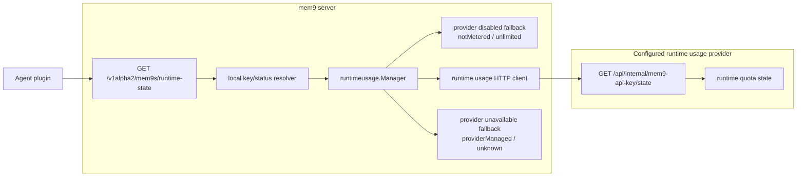

## Summary

Add `GET /v1alpha2/mem9s/runtime-state` to mem9-server for agent plugins.
The endpoint returns plugin-visible runtime quota facts using the same core
shape as the configured runtime usage provider state endpoint:
`mem9ApiKey`, `meters`, `budgets`, optional `quotaGateResult`, optional
`recommendedAction`, optional `providerId`, and optional `providerData`.

Runtime usage enforcement stays on the reservation plane. Runtime-state is a
read plane for warning tiers, constrained-mode notices, and provider actions.
The route uses local API-key status resolution only; tenant data DB resolution
belongs to data-plane memory/import/webhook/session routes.

## Flow



## Runtime-Enabled Behavior

When `MNEMO_RUNTIME_USAGE_ENABLED=true`, mem9-server calls:

```text
GET /api/internal/mem9-api-key/state
Authorization: Bearer <MNEMO_RUNTIME_USAGE_INTERNAL_SECRET>
X-API-Key: <public mem9 API key subject>
```

The response is mapped into the public runtime-state core. mem9-server keeps
`mem9ApiKey.status` from local key/status resolution, fills missing provider
defaults only where required for a stable public shape, and returns configured
`providerId` with object-shaped `providerData`.

`MNEMO_RUNTIME_USAGE_PROVIDER_ID` controls the public provider discriminator.
When runtime usage is enabled and the env var is omitted, mem9-server uses
`mem9-official`.

## Provider-Disabled Fallback

When runtime usage is disabled, mem9-server returns the local key status and a
local fallback with both known meters:

```json
{
  "mem9ApiKey": { "status": "active" },
  "meters": [
    {
      "meter": "memory_recall_requests",
      "quotaGateResult": {
        "outcome": "allowed",
        "mode": "notMetered",
        "reason": "runtimeUsageDisabled"
      },
      "budgets": [
        {
          "type": "notMetered",
          "state": "unlimited",
          "measure": { "kind": "count", "quantity": "request", "scale": 1 },
          "period": { "type": "none" },
          "capacity": { "type": "unlimited" }
        }
      ]
    },
    {
      "meter": "memory_write_requests",
      "quotaGateResult": {
        "outcome": "allowed",
        "mode": "notMetered",
        "reason": "runtimeUsageDisabled"
      },
      "budgets": [
        {
          "type": "notMetered",
          "state": "unlimited",
          "measure": { "kind": "count", "quantity": "request", "scale": 1 },
          "period": { "type": "none" },
          "capacity": { "type": "unlimited" }
        }
      ]
    }
  ]
}
```

## Provider-Unavailable Fallback

When runtime usage is enabled and the provider state read fails, mem9-server
returns HTTP `200` with the local key status and provider-managed unknown
budgets for both meters. This keeps plugin warmup and status refresh flows
usable while memory route reservation enforcement continues to use the existing
runtime usage settings.

Non-object `providerData` from upstream is treated as an invalid provider state
response and uses this fallback.

## Domain Terms

- Runtime-state read plane: advisory state used by plugins for notices and
  action links.
- Reservation plane: authoritative runtime enforcement path used before recall
  and write operations.
- Provider-disabled fallback: self-host response where runtime usage is not
  configured.
- Provider-unavailable fallback: hosted response shape used when state lookup
  fails.
- Provider ID: public discriminator for interpreting provider-specific
  `providerData`.
